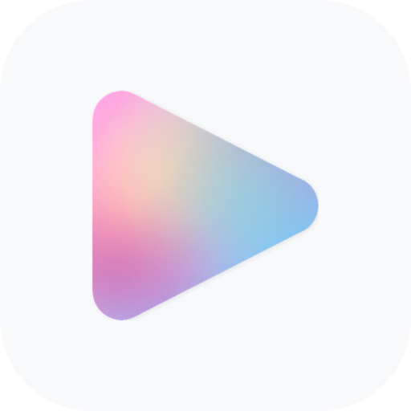
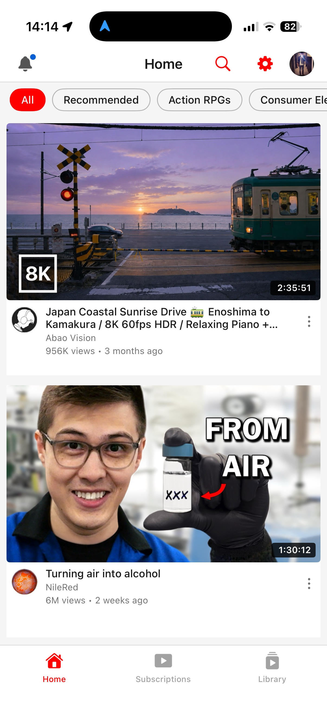
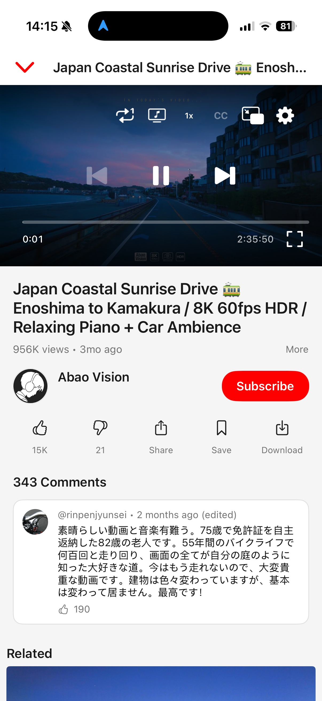
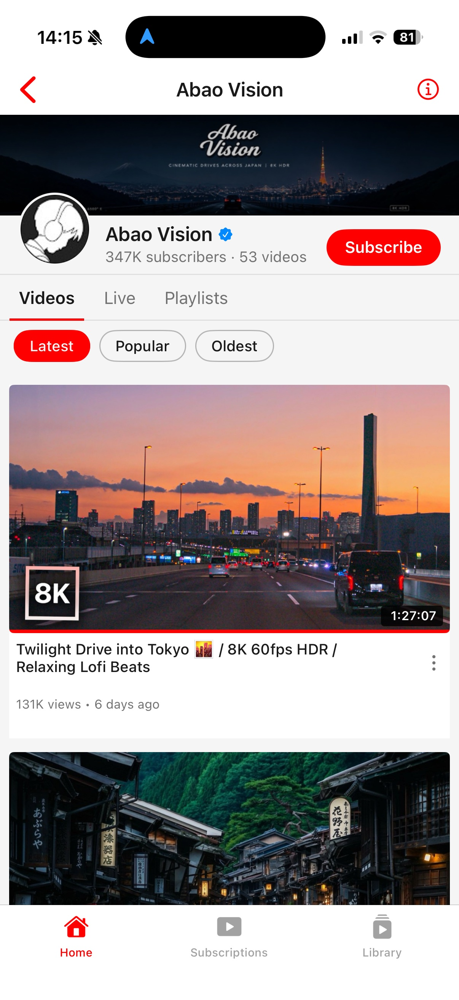
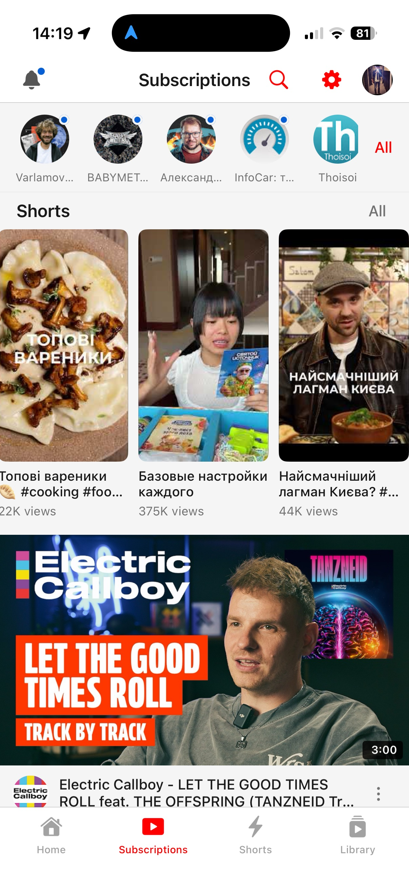
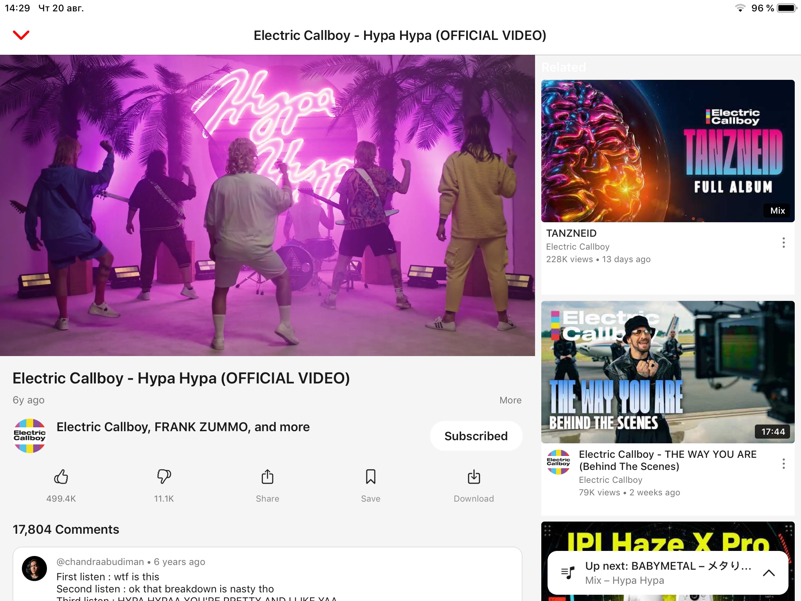
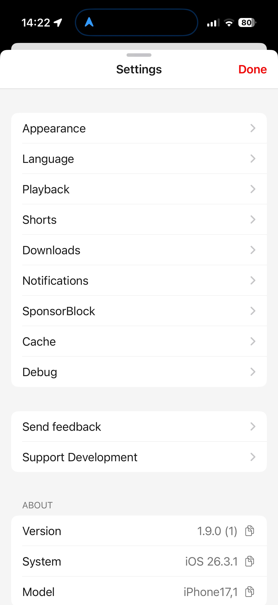
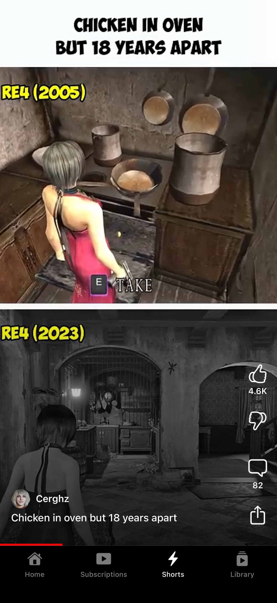
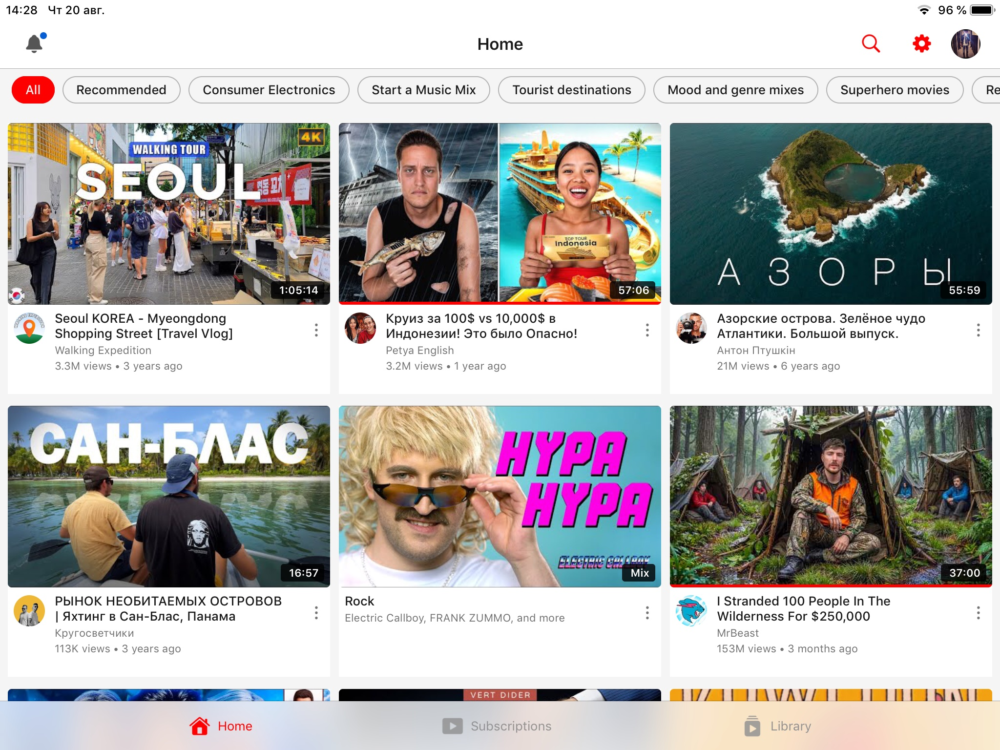
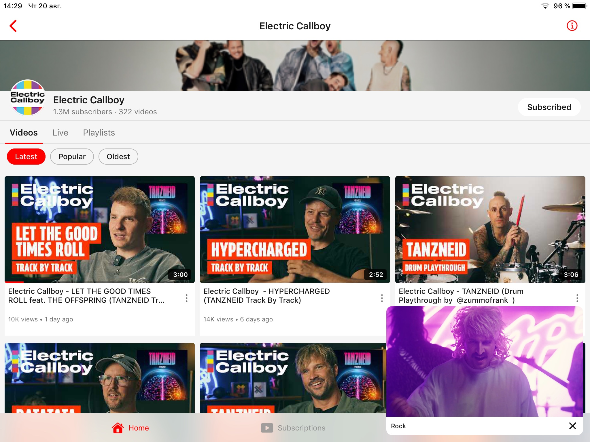

<div align="center">

# Opaline

<picture>
  <source media="(prefers-color-scheme: dark)" srcset="source/logo-dark.png">
  
</picture>

**A lightweight, native YouTube client for iOS 12+. No ads, no tracking, no dependencies.**

[](https://github.com/verback2308/Opaline/releases/latest)
[](https://github.com/verback2308/Opaline/releases)

[](LICENSE)

</div>

<sub>Opaline was released as YTLite until August. It was renamed to avoid confusion with an unrelated tweak of the same name and is not related to it.</sub>

<div align="center">

<br>

<picture>
  <source media="(prefers-color-scheme: dark)" srcset="screenshots/app/iphone/dark/recommendations.jpeg">
  
</picture>
<picture>
  <source media="(prefers-color-scheme: dark)" srcset="screenshots/app/iphone/dark/player.jpeg">
  
</picture>
<picture>
  <source media="(prefers-color-scheme: dark)" srcset="screenshots/app/iphone/dark/channel.jpeg">
  
</picture>
<picture>
  <source media="(prefers-color-scheme: dark)" srcset="screenshots/app/iphone/dark/subscriptions.jpeg">
  
</picture>

<sub>Screenshots follow your GitHub theme — the app supports both light and dark mode.</sub>

</div>

## Why

When Google dropped support for the official YouTube app on older devices, there was no way to watch videos properly. Browsers capped quality at 360p — and even that barely ran. Opaline was born to restore what was lost: high-quality playback on hardware that still works fine, just ignored by Google — a focused, lightweight client that does one thing well.

## Features

- **Video playback** — up to 1080p 60fps on every device; 2K/4K on hardware with AV1 decode (iPhone 15 Pro and newer, M3+ iPads)
- **Shorts** — a native full-screen viewer with vertical swiping, likes, comments and sharing; the next short is preloaded so it opens on video rather than a poster. Tapping a short anywhere carries that list into the viewer, and the whole tab can be switched off
- **Kids content** — plays videos the standard API sources refuse, via a dedicated playback source
- **Offline downloads** — save a video to the device and watch it with no network. Its page comes along: thumbnail, description, like counts and the comments as of the moment you saved it. Settings → Downloads picks the quality, how many comments and which subtitle languages travel with it, and a video that plays dubbed in your language is saved dubbed
- **Pinch to zoom** — fill the screen in fullscreen with a pinch, or turn on Zoom to Fill to do it automatically
- **Background audio** — continue listening with the screen off
- **Media controls** — play/pause and next/previous video from Control Center, the lock screen and headphones
- **Picture-in-Picture** — watch while using other apps
- **SponsorBlock** — skip sponsored segments automatically
- **Return YouTube Dislike** — see dislike counts again
- **Audio tracks** — switch dubbed audio on multi-language videos, or start videos dubbed in your language automatically; AI auto-dubs are marked "(AI)"
- **Subtitles** — full subtitle/caption support with VTT parsing
- **13 languages** — localized interface, with video titles/search/feeds following your language (see [Localization](#localization))
- **Search & browse** — live suggestions, recent-search history, filters (sort, upload date, type, duration), channel pages, playlists
- **Smart home feed** — endless recommendations with category chips read from your feed's shelves
- **Subscriptions** — follow channels with a local subscription feed
- **Notifications** — a bell in the top bar collects app news and new-version announcements, with the full release notes in the message; system notifications are optional and everything still collects in-app if you decline
- **Watch history** — progress indicators, synced across devices; a video resumes where you left it the moment you reopen it, without waiting for the server to catch up
- **Autoplay** — automatically play the next related video, with replay, previous and next offered when one ends
- **Auto theme** — follows system dark mode on iOS 13+, scheduled hours on iOS 12; manual override available
- **Made for old hardware** — thumbnails and channel details are fetched and decoded a few at a time rather than all at once, which is what keeps scrolling smooth on a dual-core A7
- **Your layout** — pick the tab the app opens on, force the icon light or dark, and browse settings as a nested menu instead of one long list

<div align="center">

<picture>
  <source media="(prefers-color-scheme: dark)" srcset="screenshots/app/ipad/dark/player.jpeg">
  
</picture>

<sub>Native iPad layout — player and related videos side by side.</sub>

</div>

<details>
<summary><b>More screenshots</b></summary>
<br>
<div align="center">

<picture>
  <source media="(prefers-color-scheme: dark)" srcset="screenshots/app/iphone/dark/settings.jpeg">
  
</picture>

<picture>
  <source media="(prefers-color-scheme: dark)" srcset="screenshots/app/ipad/dark/recommendations.jpeg">
  
</picture>

<picture>
  <source media="(prefers-color-scheme: dark)" srcset="screenshots/app/ipad/dark/channel.jpeg">
  
</picture>
<picture>
  <source media="(prefers-color-scheme: dark)" srcset="screenshots/app/ipad/dark/subscriptions.jpeg">
  
</picture>

</div>
</details>

## Installation

Opaline runs on devices with **iOS 12 and above**.

For older hardware — armv7 devices on iOS 9.3, such as the iPad 2, iPad 3, iPad mini and iPhone 4S — [Joeviocoe/Opaline](https://github.com/Joeviocoe/Opaline) is a downport by another developer, with hardware-keyboard support and account-free local subscriptions and history. It is a separate project: we do not build, test or support it.

### Non-jailbroken devices

**Option 1 — Add source (recommended)**

Add the Opaline source to your sideloading app to receive automatic updates:

<a href="https://stikstore.app/altdirect/?url=https://verback2308.github.io/repo/apps.json"></a>

**Option 2 — Manual install**

[Download the latest IPA](https://github.com/verback2308/Opaline/releases/latest) and install via **SideStore**, **AltStore**, or **LiveContainer**.

**Option 3 — Build from source**

```bash
git clone https://github.com/verback2308/Opaline.git
cd Opaline
cp Config/Local.xcconfig.example Config/Local.xcconfig
./make_ipa.sh
```

### Jailbroken devices

**Option 1 — Cydia/Sileo repo (recommended)**

Add the repo to your package manager to install Opaline and receive automatic updates:

```
https://verback2308.github.io/repo/
```

Rootful (`iphoneos-arm`) and rootless (`iphoneos-arm64`) packages are provided; Sileo, Zebra and Cydia are supported. Every released version stays available in the repo, so you can also install or roll back to an older one (Sileo/Zebra: package page → version list).

Pick one channel and stay on it — the repo package and the IPA share a bundle identifier, and having both installed leaves an app icon the Home Screen cannot delete. Already have the other one? Remove it first: the IPA from the Home Screen, the repo package from your package manager (or `dpkg -r com.verback.ytlite` over SSH).

**Option 2 — Manual install**

Install the `.ipa` package directly:
- **Filza** — open the `.ipa` file → Install
- **ReProvision** — sign and install the IPA from the app

## Known Issues and Limitations

- Playback speeds above 2x may cause issues
- Comments are read-only — you can browse and sort them and open replies, but not post, reply or like
- Notification delivery is scheduled by iOS, which grants background time at its own discretion — expect news to arrive within hours of publication, not minutes, and not at all while Background App Refresh or Low Power Mode says otherwise
- **Picture in Picture is limited by the system before iOS 15**, and no app can work around it: the window survives exactly one video, and switching to another one closes it and leaves audio playing — [the full findings are in issue #31](https://github.com/verback2308/Opaline/issues/31#issuecomment-5148224679)
  - Before iOS 14.2 the system only starts PiP by itself from **fullscreen**. Leaving the app while the video plays inline gives background audio instead — the PiP button works in both cases
  - Before iOS 15 background audio requires the player to give up its video layer, and the system then refuses to open PiP for that video at all. So once a video has played in the background, automatic PiP no longer starts for it — the PiP button still does, and the next video starts clean
  - On a **jailbroken device** PiP may not start at all — confirmed on an iPad mini 2 running iOS 12.5.8 with Chimera, and likely the same on checkra1n. The jailbreak denies it, not the app; installing [ForceInPicture](https://github.com/PoomSmart/ForceInPicture) restores it

## Localization

The interface follows your system language by default and can be overridden in **Settings → Language**. The content language (video titles, search, feeds — translated server-side by YouTube, like the official app) follows the app language; the region can be set separately.

> [!NOTE]
> Wording follows the official YouTube app's own translations wherever it has an equivalent string, but mistakes are still possible. If you spot a wrong or awkward translation — or want a language that isn't here — please [open an issue](../../issues) describing where it appears and what the correct wording should be.

<details>
<summary><b>Available in 13 languages</b></summary>
<br>

| | | | |
|---|---|---|---|
| `en` English | `ru` Русский | `uk` Українська | `de` Deutsch |
| `es` Español | `fr` Français | `it` Italiano | `ja` 日本語 |
| `pt` Português | `tr` Türkçe | `vi` Tiếng Việt | `zh-Hans` 简体中文 |
| `zh-Hant` 繁體中文 | | | |

</details>

## Playback Helper Server

Signed-in playback relies on a small companion service, and so does the Mobile Web source it falls back to. Preparing these streams requires evaluating JavaScript from YouTube's public player page — something iOS 12-era devices can't do on-device. The app delegates that single step to the helper server and receives the computed result back.

Since 14 August this covers more than it used to. Dubbed audio and videos made for kids are prepared this way, so if the service is unreachable, dubs quietly fall back to the original audio and kids videos won't play until it's back.

**What it sees:** no account data, no tokens, no cookies, no watch history — only the challenge strings taken from the public player code and the ID of the video being prepared. If you're inspecting traffic and wondering about requests to a non-YouTube host — that's this.

The server's source code will be published later so you can host your own instance and point the app at it (**Settings → Debug → Solver Server**).

## Bug Reports

If you encounter a bug, you can export debug logs directly from the app:

**Settings → Debug → Share Debug Log**

This generates a log file you can attach to your GitHub issue. The log includes timestamped playback, API, and caching events that help diagnose problems.

<details>
<summary><b>For developers</b></summary>

## Building

```bash
git clone https://github.com/verback2308/Opaline.git
cd Opaline
cp Config/Local.xcconfig.example Config/Local.xcconfig
open Opaline.xcodeproj
```

Edit `Config/Local.xcconfig` and set your own `PRODUCT_BUNDLE_IDENTIFIER`.
`APP_MANIFEST_URL` in the same file points the update check at a release
manifest — leave the default to follow this repository, or aim it at a file
served from your own machine to test notifications. Release builds get the
URL of whatever repository they are built from, written in by the workflow.

Select the **Opaline** scheme, choose your device or simulator, and build (⌘B).

## Architecture

```
Opaline/
├── App/              Composition root: AppDelegate, DI wiring, tab bar
├── Core/             Shared kernel (features depend on it, never on each other)
│   ├── API/          YouTube Innertube API client
│   ├── Auth/         OAuth device-code flow
│   ├── Config/       URLs, UserDefaults keys, constants
│   ├── Transport/    HTTP abstraction + decorators
│   ├── Playback/     VideoSource contracts, sources, HLS machinery
│   ├── Services/     Caching, SponsorBlock, RYD, subtitles, watchtime
│   └── Common/       Shared UI components & utilities
└── Features/         One vertical slice per feature
    ├── Channel/      Channel page with tabs
    ├── Home/         Home feed
    ├── Library/      Playlists & saved videos
    ├── Player/       Video player & watch page
    ├── Profile/      User profile
    ├── Search/       Search with suggestions
    └── Subscriptions/ Subscription feed
```

### Key Design Decisions

- **Zero external dependencies** — Networking via a custom `HTTPTransport` abstraction over `URLSession`, images via custom `ThumbnailImageView`, playback via `AVPlayer`
- **All UIKit, no SwiftUI** — Programmatic layout, no storyboards
- **iOS 12+ support** — No SF Symbols, no SwiftUI, no Combine
- **Manual JSON parsing** — `JSONSerialization` + dictionary traversal for YouTube Innertube API responses
- **Dependency injection** — `ServiceContainer` provides services; view controllers receive dependencies via initializers

### Playback Pipeline

Playback is built on a single `VideoSource` abstraction — each way of playing a video implements the same interface and owns both stream resolution and quality selection. `PlaybackFacade` just asks a factory for the configured source, calls `loadPlayback`, and hands the prepared `AVPlayerItem` to the player shell. The sources:

1. **Auto** *(default)* — Composite: tries Android VR first, transparently falls back to Mobile Web when a video fails to resolve or start.
2. **Android VR** — Streams via YouTube's Innertube API; adaptive formats (360p–1080p AVC, up to 4K AV1 on supported hardware) are converted from DASH SIDX byte ranges into an HLS playlist for native `AVPlayer`, with progressive/native-HLS fallbacks.
3. **Mobile Web** — Handles videos the Android VR client refuses (e.g. kids content). Stream URLs require solving JavaScript challenges from the player page; that step is delegated to the helper server (see above), everything else stays on-device.
4. **Progressive** — Direct 360p MP4 URL for the restricted case (e.g. server-side A/B experiments).

Quality selection is source-agnostic: the player UI simply renders whatever qualities the active source reports. Background audio is `AVAudioSession`-based and works across all sources.

### Authentication

OAuth device-code flow: the app requests a device code → user enters it at google.com/device → tokens are stored in Keychain. Anonymous browsing is supported.

## Project Structure

| Component | Purpose |
|-----------|---------|
| `InnertubeClient` | YouTube API: browse, search, player, comments, subscriptions |
| `PlaybackFacade` | Selects a `VideoSource` via factory, loads it, and drives player setup |
| `VideoPlayerView` | Custom player UI with controls, gestures, PiP |
| `WatchViewController` | Watch page: player + metadata + comments + related |
| `AppCache` | Dual-layer cache (memory + disk) with TTL |
| `SponsorBlockController` | SponsorBlock API integration |
| `ThemeManager` | App-wide theming (dark/light) |

## Contributing

1. Fork the repository
2. Create a feature branch (`git checkout -b feature/my-feature`)
3. Commit your changes (`git commit -am 'Add my feature'`)
4. Push to the branch (`git push origin feature/my-feature`)
5. Open a Pull Request

Please follow the existing code style. SwiftLint is configured and runs as a build phase.

</details>

## Support

If Opaline keeps your old device alive, you can support development:

<a href="https://buymeacoffee.com/verback2308" target="_blank" rel="noopener noreferrer"></a>

## Credits

- [SponsorBlock](https://github.com/ajayyy/SponsorBlock) — crowdsourced API for skipping sponsored segments
- [Return YouTube Dislike](https://github.com/Anarios/return-youtube-dislike) — community-maintained dislike count data
- [yt-dlp](https://github.com/yt-dlp/yt-dlp) — invaluable reference for understanding YouTube's playback infrastructure
- [YouTubeLegacy](https://github.com/PoomSmart/YouTubeLegacy) — inspiration for keeping YouTube alive on older devices

## Legal

This project is for educational and personal use. It is not affiliated with, endorsed by, or connected to Google or YouTube. Use at your own risk.

## License

[GNU General Public License v3.0](LICENSE) — any derivative work must also be released under GPLv3 with its full source code.
